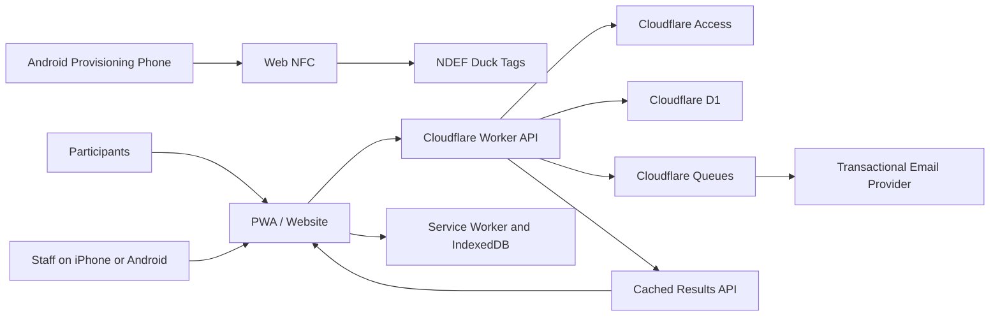

# Duck Race Manager Project Plan

## 1. Executive Summary

Duck Race Manager will manage the complete lifecycle of an annual physical
duck race:

1. Participants register on a public website.
2. Staff locate a participant's registration and scan the participant's chosen
   duck.
3. The system permanently identifies the duck by a random token stored in the
   duck's NFC URL.
4. The event either assigns ducks to ten-duck heat bags during pairing or waits
   until registration closes and scans a random, balanced draw into heat bags.
5. The winner of each first-round heat is scanned and moved to a winners bag.
6. Officials scan the expected winners into one final heat.
7. First, second, and third place are scanned and published.
8. Participants and spectators view finalized heat winners and the final podium
   on the public website.
9. Participants who provide email can receive heat-assignment and upcoming-heat
   notifications.

The recommended product is a responsive progressive web application (PWA), not
a native mobile app. NFC tags are provisioned once from a protected page in
Android Chrome. Registration and race-running workflows then work on supported
iPhones and Android phones.

The first release is for one organization and multiple annual race events. It
is not intended to be a general-purpose tournament platform or multi-tenant
software-as-a-service product.

## 2. Goals

- Provide low-friction public registration without requiring participant
  accounts.
- Let authorized staff pair registrations with physical ducks.
- Support both pairing-time fixed heat bags and post-close balanced random draw.
- Show an authoritative participant roster before every heat is announced.
- Notify participants with email when their heat is assigned and coming up.
- Let staff safely inspect any duck's assignment, heat, expected bag, and race
  status without changing it.
- Let staff replace or swap physical ducks without losing a participant's heat
  slot or historical results.
- Make common staff workflows fast and understandable to non-technical users.
- Create each annual event from prior settings while preserving race history.
- Return eligible ducks to reusable inventory or record that participants kept
  them.
- Enforce race rules and prevent duplicate assignments, heat entries, and
  results.
- Automatically promote first-round winners into the final.
- Publish trustworthy, privacy-conscious results.
- Operate safely during short internet outages.
- Work on both iPhones and Android phones for normal race-day tasks.
- Avoid a native app, App Store distribution, and mobile release management.
- Preserve a usable QR and manual-entry path whenever NFC fails.

## 3. Non-Goals for the First Release

- Online payments
- Waivers or guardian/minor workflows
- Configurable registration form builders
- Participant accounts or passwords
- Age divisions or multiple race classes
- More than two racing rounds
- Multiple winners advancing from each first-round heat
- General tournament brackets
- Multi-organization tenancy
- NFC-based authentication or anti-counterfeit guarantees
- Automatic race timing or camera-based finish detection
- Marketing email campaigns or SMS notifications

These features can be evaluated after the core annual race has been operated
successfully.

## 4. Confirmed Product Decisions

| Decision | Selected approach |
| --- | --- |
| Repository | Public `jameskorzekwa/duck-race-manager` repository |
| Participant client | Responsive public website |
| Staff client | Responsive installable PWA |
| NFC identifier | Random application token embedded in a permanent URL |
| Hardware UID | Optional diagnostic value only |
| Tag writing | Protected staff page in Android Chrome |
| Race-day phones | iPhone and Android supported |
| iPhone NFC experience | iOS reads the URL and presents a notification to open it |
| Android NFC experience | Direct in-page Web NFC when supported, URL opening fallback |
| Connectivity | Online-first with cached event data and an offline command outbox |
| Participant scale | Approximately 100 to 500 per event |
| Required fields | First name and last name |
| Email | Event setting controls optional versus required |
| Email notifications | Assignment and upcoming-heat transactional messages |
| Phone | Optional |
| Race format | Multiple first-round heats and one final |
| Heat assignment modes | Immediate fixed ten-duck heats or post-close balanced draw |
| Pre-heat operation | Staff announcer view lists every participant in the heat |
| Duck diagnostics | Authenticated read-only scan with status and location history |
| Duck replacement | Race entry retains heat/qualification while physical duck changes |
| Staff UX | Role-specific, scan-first, plain-language guided workflows |
| Event history | New annual races preserve prior registrations, heats, and results |
| Duck reuse | Only physically returned and inspected ducks become available again |
| Keep option | Participant preference plus staff-confirmed final disposition |
| Advancement | One winner from each first-round heat |
| Final result | First, second, and third place |
| Email queue | Cloudflare Queues |
| Email delivery | Amazon SES through a provider adapter; expected cost accepted |

## 5. NFC Design

### 5.1 Tag Contents

Each duck receives a permanent random identifier, preferably at least 128 bits
of cryptographically secure randomness encoded in a URL-safe format. The tag
stores one NDEF URL record:

```text
https://example.org/t/fG9pV8rB2mK4qX7zLcN1Aw
```

The URL contains no participant, registration, event, result, or contact
information. The token identifies only the permanent physical duck.

The database maps the token to the duck:

```text
token fG9pV8rB2mK4qX7zLcN1Aw -> Duck #142
```

Annual assignments are separate database records:

```text
2027 race -> Duck #142 -> Registration #ABC123
```

This separation lets the same duck and NFC tag be reused every year without
rewriting the tag.

### 5.2 Why Hardware Serial Numbers Are Not Primary Identifiers

Android Web NFC can expose a `serialNumber` during an in-page read, but the
value can be empty. When an iPhone opens an NDEF URL, it does not append the
tag's hardware serial number to the URL. Standard tags store static data and do
not dynamically inject their UID into a URL.

The provisioning system may record an Android-observed serial number for
diagnostics and duplicate investigation. Correct operation must depend only on
the random URL token.

### 5.3 Stable Domain Requirement

The tag domain must be owned and retained for the useful lifetime of the
ducks. Tags must never contain preview, vendor, or temporary deployment URLs.

Recommended shape using the application's canonical production origin:

```text
https://<permanent-race-domain>/t/<token>
```

The tag URL should not redirect to another origin. Keeping public pages, staff
sessions, the offline service worker, and tag URLs on one origin avoids
cross-domain cookie and offline-navigation failures. A `www` hostname may
redirect to the canonical origin, but production tags contain the canonical
origin directly. The domain may route to different hosting infrastructure in
the future, but it must always remain under the race organization's control.

Detailed setup and the mandatory pre-provisioning gate are documented in
[DOMAIN_SETUP.md](DOMAIN_SETUP.md).

### 5.4 Physical Identification Fallbacks

Every duck should have three matching identifiers:

- NFC tag containing the permanent HTTPS URL
- Waterproof QR code containing the same URL
- Human-readable permanent duck number

The visible number is essential for correcting mistakes and continuing the
race when a tag, phone, camera, or network fails.

## 6. Tag Provisioning

### 6.1 Prerequisites

- Known writable NDEF tags
- NFC-capable Android phone
- Current Android Chrome browser
- HTTPS production or staging origin
- Logged-in user with a dedicated provisioning permission
- Permanent duck numbers attached before or during provisioning

iPhone browsers cannot perform the provisioning workflow because they do not
expose Web NFC read/write APIs.

### 6.2 Protected Provisioning Page

The PWA will expose a protected route such as:

```text
/staff/ducks/provision
```

Only an administrator or staff member with `DUCK_PROVISIONER` permission can
access the page or its mutation endpoints. Authorization is enforced by the
server, not only by hidden interface controls.

### 6.3 Sequential Provisioning Workflow

1. An administrator creates the permanent duck inventory and visible numbers.
2. The provisioner opens the page in Android Chrome and selects the event's
   duck inventory.
3. The page displays the next unprovisioned duck.
4. The server reserves a unique token and generates its permanent URL.
5. The provisioner presses `Write Duck #001`.
6. The page invokes `NDEFReader.write()` in response to that user action.
7. The provisioner touches the phone to Duck #001's tag.
8. The write promise resolves only after Chrome reports a successful write.
9. The page reads the tag and verifies the exact URL when practical.
10. The server marks the tag active only after successful verification.
11. The interface provides a green visual result, sound, and vibration.
12. The page advances to the next duck.

Web NFC write operations require a visible top-level HTTPS page, an unlocked
phone, browser permission, and a user gesture. Permission is origin-scoped, but
the design should retain one explicit `Write` press per duck.

### 6.4 Provisioning Modes

| Mode | Use |
| --- | --- |
| Sequential | Fast initial provisioning of a numbered collection |
| Select duck | Repair, replacement, or out-of-order provisioning |
| Verify only | Confirm that a tag contains the expected project URL |

### 6.5 Provisioning States

```text
UNPROVISIONED
  -> RESERVED
  -> WRITTEN
  -> VERIFIED
  -> ACTIVE
```

Failure or historical states include:

```text
WRITE_FAILED
VERIFICATION_FAILED
FOREIGN_TAG
READ_ONLY
REPLACED
RETIRED
```

An incomplete reservation must expire safely or be explicitly retried. A
failed write must not accidentally consume a duck number or leave an active
database mapping.

### 6.6 Read-Only Tags

The project should not initially call Web NFC `makeReadOnly()`. Making a tag
read-only is irreversible and prevents correction of a bad URL or future
domain migration. Permanent locking can be reconsidered only after a complete
field rehearsal and backup strategy exist.

## 7. Cross-Platform Race-Day Scanning

### 7.1 Android

Supported Android Chrome devices use `NDEFReader.scan()` from the open PWA.
The page remains visible and receives repeated NDEF reads without navigating
away. This is the fastest supported web workflow.

### 7.2 iPhone

An iPhone website cannot start an NFC scan. On supported iPhones, iOS detects
the NDEF URL while the phone is unlocked and in use, displays a notification,
and opens the URL after the staff member taps the notification.

The iPhone flow therefore includes one additional notification tap per duck.
The browser that opens NFC links must already have a valid staff session and a
cached copy of the PWA before race-day operation.

This workflow must be rehearsed on every supported iPhone/browser combination.
The implementation must not assume that each scan reuses the same browser tab.

### 7.3 QR and Manual Entry

The PWA provides camera-based QR scanning and manual duck-number entry on both
platforms. These are first-class operational paths, not hidden debugging
features.

## 8. Active Scan Operations

The permanent tag URL identifies a duck but does not identify the staff member's
current task. Before scanning, the PWA creates an active scan operation bound
to the authenticated staff member and browser device.

Operation types include:

- Assign duck to registration
- Load duck into a first-round heat
- Inspect duck status and expected location (read-only)
- Record first-round winner
- Verify final qualifiers
- Record final first place
- Record final second place
- Record final third place

The operation contains the event, target registration or heat, operation type,
device identifier, creator, expiration, and current state.

The permanent tag URL is a read-only navigation:

```text
GET /t/<token>
```

GET requests never mutate race data. After loading, authenticated JavaScript
submits an explicit command:

```text
POST /api/staff/scan-operations/<operation-id>/tags
```

The command includes the tag token, client command UUID, browser device ID,
expected revision, and client timestamp. Server authorization, CSRF protection,
state validation, and idempotency are mandatory.

Inspection is the safe default for authenticated staff when no mutating scan
operation is active. It shows duck, participant, heat, expected physical
location, race status, synchronization state, and audit history. It never
changes state. Public tag scans continue to show only the generic duck page.

## 9. Registration Workflow

### 9.1 Public Registration

1. A participant opens the event page.
2. The participant enters first name and last name.
3. Email is required or optional according to event configuration.
4. Phone is optional.
5. The server validates, rate-limits, and stores the registration.
6. The participant receives a high-entropy private link, short staff lookup
   code, and QR code.
7. The registration remains `SUBMITTED` until a duck is assigned.

Participant accounts are not required. If no email or phone is supplied, the
confirmation page must clearly tell the participant to retain the code or QR.
Registration or duck pairing also records whether the participant plans to
keep, return, or has not decided about the duck. This preference helps planning
but does not change inventory until staff record the physical disposition.

### 9.2 Staff and Walk-Up Registration

Authorized staff can create the same registration from the staff interface.
The interface must support brief offline operation by assigning client-generated
UUIDs and queueing commands.

### 9.3 Duck Assignment

1. Staff scan the participant's confirmation QR or search by code/name.
2. Staff review the selected registration.
3. Staff start an `ASSIGN_DUCK` scan operation.
4. The participant selects a duck.
5. Staff scan the duck by NFC, QR, or visible number.
6. The PWA displays the participant and duck together.
7. Staff explicitly confirm the assignment.
8. The server creates the assignment and changes the registration to `ACTIVE`.
9. In immediate mode, the same atomic command assigns the next available slot
   in a ten-duck heat and tells staff which physical bag receives the duck.
10. In balanced-draw mode, the duck remains in the common draw pool until it is
    scanned after registration closes.

The database creates one race entry for the active registration, permits only
one current duck assignment for that race entry, and prevents one duck from
being assigned to multiple active race entries in the same event.

## 10. Heat Assignment and Planning

Each event selects one immutable mode before registration opens:

```text
IMMEDIATE_FIXED_HEATS
POST_CLOSE_BALANCED_DRAW
```

Detailed workflows, notification timing, bag handling, and offline safeguards
are specified in
[HEAT_ASSIGNMENT_AND_NOTIFICATIONS.md](HEAT_ASSIGNMENT_AND_NOTIFICATIONS.md).

### 10.1 Immediate Fixed Heats

When staff pair a duck with a participant, the server assigns the lowest-numbered
open heat with fewer than ten ducks. A full heat closes automatically and the
next assignment creates or fills the next heat. Registration closure locks the
last underfilled heat without rebalancing it.

The response identifies the heat and physical bag. Staff immediately place the
duck in that bag and confirm placement. No first-round rescan is required before
racing.

For `N` active assignments:

```text
H = ceil(N / 10)
```

The configuration is valid only when `H` fits in the final. At the upper design
limit of 500 participants, this mode creates 50 finalists, so the race director
must confirm that the physical final can support that many ducks or lower the
event capacity.

### 10.2 Post-Close Balanced Draw

Let:

- `N` be the number of active duck assignments.
- `C` be the maximum ducks allowed in a first-round heat.
- `F` be the maximum ducks allowed in the final.
- `H = ceil(N / C)` be the required first-round heat count.

Because exactly one winner from every first-round heat advances, the configured
two-round race is valid only when:

```text
H <= F
N <= C * F
```

Balanced target sizes are calculated as:

```text
base = floor(N / H)
extra = N mod H
```

`extra` heats receive `base + 1` ducks. Every remaining heat receives `base`
ducks. Heat sizes differ by at most one and never exceed `C`.

Example:

```text
N = 173
C = 25
F = 10
H = ceil(173 / 25) = 7
```

The result is five heats of 25 ducks and two heats of 24 ducks. Seven winners
fit in the final.

The administration interface must explain invalid configurations before any
heat is loaded. For example, 500 participants with 25 ducks per first-round
heat requires 20 heats and therefore a final capacity of at least 20 ducks.

The software sets balanced capacities. Physical random drawing and scanning
determine which ducks enter each heat. Officials may preload multiple heat bags
to provide participants more email notice, or load the next heat just in time.

## 11. Race Workflow

### 11.1 Preparing a First-Round Heat

In immediate mode, the heat roster and bag were created during duck pairing.
Officials select the heat and verify its expected bag and synchronized roster;
they do not rescan every duck.

In balanced-draw mode:

1. A race official selects an unclaimed heat.
2. The browser device claims responsibility for loading that heat.
3. The PWA starts a `LOAD_HEAT` operation and shows `0 of X`.
4. Officials physically draw ducks and scan them one at a time.
5. The server verifies each active assignment and rejects duplicates.
6. The PWA displays duck number, participant display name, count, and sync state.
7. Staff place accepted ducks into the labeled heat bag.
8. The roster can be locked only when the target count is reached and every
   command has synchronized.
9. The physical bag is sealed or marked ready.

### 11.2 Announcing a Heat

Before either mode can start a heat, the PWA opens `Announcer View` from the
authoritative heat entries. It shows the heat number, participant names, duck
numbers, and count. Staff read the participants aloud, optionally check off
each name, record the announcement time, and then move the heat from `CALLING`
to `RUNNING`.

### 11.3 Recording a First-Round Winner

1. An official selects `Record winner` for the completed heat.
2. The PWA starts a `RECORD_HEAT_WINNER` operation.
3. The official scans the winning duck.
4. The server verifies that the duck raced in that heat.
5. The official confirms the result.
6. The heat is finalized and its winner is published.
7. The assignment is promoted to the final roster.
8. The physical duck is placed in the winners bag.

### 11.4 Loading the Final

1. The system calculates the expected finalist set from finalized round-one
   winners.
2. An official starts `VERIFY_FINALISTS`.
3. Every duck from the winners bag is scanned.
4. The PWA identifies duplicates, unknown ducks, and missing qualifiers.
5. The final becomes ready only when the scanned set equals the expected set or
   an administrator records an audited race-director override.

### 11.5 Recording the Podium

1. Staff start the first-place operation and scan the winner.
2. Staff review and confirm first place.
3. Staff repeat for second and third place.
4. The server prevents a duck from occupying more than one place.
5. The final is published only after all three places are valid and confirmed.

## 12. State Models

### 12.1 Event

```text
DRAFT
  -> REGISTRATION_OPEN
  -> REGISTRATION_CLOSED
  -> ROUND_ONE
  -> FINAL
  -> COMPLETED
  -> RETURN_PROCESSING
  -> ARCHIVED
```

### 12.2 Registration

```text
SUBMITTED
  -> ACTIVE
  -> WITHDRAWN or DISQUALIFIED
```

### 12.3 Heat

```text
PLANNED
  -> LOADING
  -> READY
  -> CALLING
  -> RUNNING
  -> AWAITING_RESULT
  -> FINALIZED
```

An administrator can reopen a heat only with a recorded reason. Reopening a
round-one result must detect and invalidate dependent final state rather than
silently leaving an inconsistent final.

Archived events retain their registrations, assignments, heats, results,
notifications, dispositions, and audits. Creating a new race copies only
approved settings. Detailed lifecycle and reuse rules are documented in
[RACE_LIFECYCLE_AND_DUCK_REUSE.md](RACE_LIFECYCLE_AND_DUCK_REUSE.md).

## 13. Proposed Architecture



Recommended implementation stack:

| Layer | Recommendation |
| --- | --- |
| Language | TypeScript |
| Web framework | Next.js |
| UI | Responsive React application with accessible mobile controls |
| PWA | Service worker, install manifest, cached navigation shell |
| Database | Cloudflare D1 |
| Authentication | Cloudflare Access identity plus D1 event roles |
| Results updates | Conditional polling with caching and manual refresh |
| API | Next.js server routes deployed through Cloudflare Workers |
| Validation | Shared Zod request/response schemas |
| Offline data | IndexedDB and an idempotent command outbox |
| Bot protection | Cloudflare Turnstile on public registration |
| Background jobs | Cloudflare Queues for email delivery and retries |
| Transactional email | Amazon SES through a provider adapter |
| Hosting | Cloudflare Workers with static assets and custom domains |
| CI | GitHub Actions |

The final dependency versions should be selected from current stable releases
when implementation begins.

### 13.1 Hosting Decision

Cloudflare Workers and D1 are the recommended free production platform. As
reviewed in July 2026, the free Workers plan includes 100,000 dynamic requests
per day and free unlimited static asset requests. D1 includes 5 million rows
read per day, 100,000 rows written per day, and 5 GB total storage. D1 scales to
zero instead of pausing an inactive annual project.

These limits are suitable for the expected registration and race operations if
queries are indexed and the public results page polls responsibly. Results
polling should pause in hidden tabs, use conditional requests, and default to a
30-to-60-second interval. Usage must be monitored during rehearsal. If the
event is projected to exceed the free Worker request allowance, the Workers
Paid plan can be enabled for the event period rather than risking rejected
race-day requests.

Cloudflare Access provides staff identity through approved-email one-time PIN
or a configured identity provider. Application roles remain in D1, so a valid
Access identity does not automatically grant every race permission. Public tag
routes remain accessible without Access, while every staff command validates
the Access assertion and application role.

Cloudflare Turnstile protects public registration without introducing a paid
CAPTCHA service. The Next.js application is deployed to Workers through the
Cloudflare OpenNext adapter and must be tested in the Workers runtime, not only
the local Node.js development server.

Vercel Hobby is not the default because it permits only personal,
non-commercial use; its policy treats payment, donations, or paid production
work as commercial. Supabase Free is not the default because free projects are
paused after one week of inactivity, which is a poor fit for an annual event.

Hosting can remain free, but a permanent custom domain is not free. The
organization must purchase and retain the domain before production NFC tags
are written. Development can use a `workers.dev` address, but permanent tags
must use the organization's stable custom domain. Cloudflare Workers Custom
Domains create the required DNS record and TLS certificate automatically after
the domain is active in Cloudflare. See
[DOMAIN_SETUP.md](DOMAIN_SETUP.md) for the complete setup and verification
checklist.

Email delivery is a separate metered service. Free provider limits reviewed in
July 2026 are too low for a possible 500-participant race-day batch. Amazon SES
is selected because expected event volume costs only cents and has no required
monthly minimum under a-la-carte pricing. Cloudflare Queues remains within its
free allowance at this scale.

## 14. Data Model

### 14.1 Core Tables

| Table | Purpose |
| --- | --- |
| `events` | Annual race configuration, capacities, dates, and lifecycle |
| `staff_profiles` | Staff identity linked to the authentication provider |
| `event_staff` | Event-specific role grants |
| `browser_devices` | Authorized PWA installation and sync metadata |
| `registrations` | Participant details, status, and confirmation identifiers |
| `ducks` | Permanent physical duck inventory and visible number |
| `duck_tags` | Permanent token, status, and optional observed serial |
| `event_ducks` | Eligible permanent ducks reserved for a specific event |
| `race_entries` | Stable participant identity and progression within an event |
| `duck_assignments` | Versioned race-entry-to-duck history with start/end reason |
| `scan_operations` | Short-lived staff scanning context |
| `heats` | Round, heat number, target size, status, and device claim |
| `heat_entries` | Race-entry heat slot, including assignment source/time |
| `heat_roster_calls` | Announcer completion, checklist, actor, and timestamp |
| `heat_results` | Ranked race entry and physical duck assignment used in that heat |
| `duck_location_events` | Append-only expected physical location history |
| `duck_event_dispositions` | Returned, kept, damaged, missing, or unresolved outcome |
| `duck_inventory_events` | Append-only cross-event inventory history |
| `email_notifications` | One logical participant notification and delivery state |
| `email_attempts` | Provider attempts, message IDs, errors, and timestamps |
| `race_commands` | Idempotent online/offline mutation log |
| `audit_events` | Corrections, overrides, permissions, and state changes |

### 14.2 Required Constraints

- Tag token is globally unique.
- Visible duck number is unique among active ducks.
- One active race entry per registration and event.
- One active duck assignment per race entry.
- One active race entry per duck and event.
- One first-round heat entry per race entry and event.
- Heat assignment mode cannot change after the first duck pairing.
- Immediate mode cannot place more than ten ducks in a first-round heat.
- Balanced-draw mode cannot create heat entries before the post-close plan.
- Heat entry count cannot exceed target capacity.
- A result must reference an entry from the same heat.
- A result place is unique within a heat.
- A race entry cannot occupy multiple result places in one heat.
- An event has exactly one final heat.
- Final entrants originate from finalized first-round winners.
- A race command UUID is processed at most once.
- A registration receives at most one logical notification of each type per
  heat.
- Replacing a duck preserves the race entry and heat slot.
- Every result records the physical duck assignment actually used in that heat.
- A duck is reusable only after confirmed return and condition approval.
- New events never copy registrations, race entries, assignments, heats,
  results, notifications, dispositions, or audit records.

Historical heat entries must retain the assignment used at race time. Later
corrections must not rewrite past results without an explicit audited operation.

## 15. API and Command Design

Critical mutations should be explicit domain commands rather than unrestricted
client writes to database tables.

| Command | Purpose |
| --- | --- |
| `createRegistration` | Public, staff, or offline walk-up registration |
| `reserveTagToken` | Generate a token for an unprovisioned duck |
| `confirmTagProvisioning` | Activate a successfully verified tag |
| `replaceDuckTag` | Retire and replace a failed or incorrect tag |
| `assignDuck` | Pair a registration with a duck |
| `replaceRaceEntryDuck` | Replace a lost/damaged duck while preserving progression |
| `swapRaceEntryDucks` | Exchange two physical ducks while preserving heat slots |
| `createHeatPlan` | Calculate and approve balanced capacities |
| `claimHeat` | Assign one browser device to a heat |
| `addHeatEntry` | Record a scanned duck in a heat |
| `lockHeatRoster` | Seal a synchronized roster |
| `markHeatAnnounced` | Record the pre-race participant call |
| `advanceRaceProgress` | Select current/upcoming heat and enqueue due notices |
| `recordHeatResult` | Record a winner or podium place |
| `finalizeHeat` | Publish results and create promotions |
| `reopenHeat` | Perform an audited correction |
| `markDuckLocation` | Record missing, found, or corrected physical location |
| `createEventFromPrevious` | Copy approved settings into a new draft race |
| `reserveEventDucks` | Select reusable permanent inventory for an event |
| `recordDuckDisposition` | Record returned, kept, damaged, or unresolved outcome |
| `archiveEvent` | Validate returns and preserve the completed event |
| `syncCommands` | Upload ordered offline commands |

Every mutation includes a client command UUID, staff/device identity when
applicable, expected entity revision, client timestamp, and server timestamp.
Responses explicitly distinguish accepted, duplicate, stale, unauthorized,
invalid-state, and conflict outcomes.

Duck inspection is a query rather than a mutation. It derives a read-only
snapshot from tag, assignment, heat, location, result, command, and audit data.

Duck replacement and swapping are atomic commands. Heat entries reference the
stable race entry, while results retain the assignment used in that race. This
allows a lost duck to be replaced without rewriting the participant's history.
Detailed semantics and staff steps are documented in
[STAFF_UX_AND_DUCK_RECOVERY.md](STAFF_UX_AND_DUCK_RECOVERY.md).

### 15.1 Email Commands and Queue

Heat assignment and race-progress commands create unique notification records
and publish their IDs to Cloudflare Queues. A consumer renders a versioned
template and calls an `EmailSender` provider adapter. Retries, provider IDs,
bounces, suppressions, and permanent failures are recorded without delaying or
blocking the race command.

## 16. Offline and Spotty Connectivity

The PWA caches the minimum data required for the active event:

- Duck numbers and tag tokens
- Participant first and last names
- Registration status and confirmation code
- Current duck assignments
- Heat plan, heat entries, and finalized results
- Staff role and browser device identity
- Current entity revisions
- Pending command outbox
- Expected duck locations and email delivery summaries

Email and phone should not be replicated to every race-day browser unless an
explicit workflow needs them.

Offline behavior requirements:

- Save a scan locally before reporting success to staff.
- Mark unsynchronized operations clearly.
- Retry safely without duplicate assignments or entries.
- Preserve command order and dependencies.
- Prevent authoritative heat finalization while required commands are pending.
- Bind a heat to one browser device to reduce offline conflicts.
- Show the public website's last successful update time.
- Remove event caches from staff devices after the retention period.
- Never guess the next immediate heat from multiple offline registration
  stations; pre-claim bags, use one station, or wait for synchronization.
- Queue email only after the authoritative server accepts the triggering
  command.

Android direct Web NFC can continue while the cached PWA remains open. On
iPhone, scanning opens a URL navigation, so the service worker must serve the
tag route from the cached application shell. This is a mandatory field-test
scenario. QR scanning inside the already-open PWA and manual entry remain the
fallback if iOS navigation cannot complete during an outage.

A dedicated event hotspot, backup phones, charging packs, and a printed/CSV
roster are still part of the operational plan.

## 17. Public Results

The public event page shows:

- Event and registration status
- Numbered first-round heats
- Finalized winner for each completed heat
- Pending status for incomplete heats
- Expected or confirmed final roster when appropriate
- Final first, second, and third place
- Last update time

Contact information is never public. The default display policy should be first
name plus last initial. Full-name publication requires explicit event policy
and registration notice.

Private registration-status pages use high-entropy bearer tokens and are marked
for search-engine exclusion. Short confirmation codes are staff lookup values,
not public authentication tokens.

The private status page shows the participant's assigned heat as soon as it is
known. In balanced-draw mode it clearly shows `Heat assignment pending` until
the duck is scanned into a locked roster.

## 18. Roles and Authorization

| Role | Permissions |
| --- | --- |
| Administrator | Configuration, staff, provisioning, corrections, exports, all race actions |
| Duck provisioner | Inventory lookup, tag writing, verification, replacement |
| Registration staff | Registration lookup/create and duck assignment |
| Race official | Heat loading, result recording, final verification |
| Results viewer | Read operational data without mutations |

All authenticated staff may inspect a duck. Participant contact details in the
inspection view remain limited to registration staff and administrators.

Authorization is checked at the Cloudflare Access boundary and again in every
API domain command using D1 event roles. Database constraints enforce race
invariants. The client interface must never be the only enforcement point.

## 19. Security and Privacy

- Store no participant information on NFC tags or duck QR labels.
- Treat NFC tokens and hardware UIDs as identifiers, not credentials.
- Require authentication and authorization for every race mutation.
- Use secure, same-site cookies and CSRF protection for browser commands.
- Validate Cloudflare Access assertions on every protected API request.
- Enforce authorization in server-side command handlers before D1 access.
- Store private registration bearer tokens as hashes where practical.
- Rate-limit registration, authentication, and private-token lookup endpoints.
- Audit result corrections, assignment changes, tag replacement, and role changes.
- Never place service credentials or production data in the public repository.
- Collect only the participant information required for the event.
- Explain operational email use when an address is collected and honor the
  participant's notification preference.
- Configure SPF, DKIM, DMARC, bounce handling, complaint handling, and provider
  suppression before sending production email.
- Define and enforce data retention after each race.
- Provide database backups and event-level CSV exports.

## 20. Staff User Experience

The interface is mobile-first, sunlight-readable, and usable with one hand.
Every scan result provides a prominent color, sound, vibration, duck number,
participant display name, operation name, and count.

Common screens are role-specific, scan-first, and limited to one clear task.
Routine staff never see tokens, database IDs, provider errors, or state-machine
terms. Lost-duck replacement is a guided flow: identify participant/old duck,
scan an available replacement, review one before/after summary, confirm, and
follow the large bag-placement instruction.

Design requirements, speed budgets, error language, training mode, replacement
flows, and non-technical usability tests are specified in
[STAFF_UX_AND_DUCK_RECOVERY.md](STAFF_UX_AND_DUCK_RECOVERY.md).

Primary staff screens:

- Login and event selection
- Connectivity, cache, and outbox status
- Participant QR scan and registration search
- Walk-up registration
- Duck assignment
- Read-only duck inspection, expected location, and audit timeline
- Duck inventory and Android-only provisioning
- Tag verification and replacement
- Lost-duck replacement and two-participant duck swapping
- New-race setup and historical race browser
- Bulk duck return/keep processing and reusable inventory
- Heat plan and printable bag labels
- Heat loading
- Announcer roster and race-progress control
- Email notification status and failures
- Round-one winner recording
- Winners-bag verification
- Final podium recording
- Conflict resolution and retry
- Administrative correction and audit history

The active operation must remain unmistakable. Assigning a duck, loading Heat
4, and recording second place must use clearly different labels and colors.
Color is never the only identifier. Common actions are one tap from the
role-specific home screen, and errors always state what happened, whether the
action saved, and what staff should do next.

## 21. Testing Strategy

### 21.1 Automated Tests

- Unit-test heat planning for every participant count through the supported
  maximum.
- Property-test capacity, balancing, and `N <= C * F` invariants.
- Test event, registration, heat, and result state transitions.
- Integration-test all database uniqueness and referential constraints.
- Test concurrent assignment and duplicate scan attempts.
- Test concurrent immediate assignments never exceed ten ducks per heat.
- Test immediate-mode closure preserves the underfilled last heat.
- Test balanced mode never assigns a heat before the post-close plan.
- Test announcer rosters match authoritative heat entries in both modes.
- Test notification uniqueness, queue replay, retries, and provider failure.
- Test role-filtered duck inspection and every expected location state.
- Test duck replacement preserves race entry, heat, qualification, and prior
  result history.
- Test two-duck swaps are atomic and preserve both heat slots.
- Test tag-only replacement leaves physical duck and race progression unchanged.
- Test new-race setup copies settings but no participant or result data.
- Test returned ducks become reusable while kept/missing ducks remain excluded.
- Run task-based usability tests with at least five non-technical volunteers.
- Test command replay, ordering, and stale-revision conflicts.
- Test authorization for every role and endpoint.
- Use Playwright for registration, staff, administration, and results flows.
- Test service-worker navigation and IndexedDB migrations.
- Run lint, formatting, type checking, tests, and production builds in CI.

### 21.2 Physical Device Tests

- Provision representative tags from Android Chrome.
- Verify exact NDEF contents after writing.
- Test Android in-page repeated scanning.
- Test iPhone background URL notifications and browser session continuity.
- Test repeated scans when browsers open new or existing tabs.
- Test tags while attached to dry and wet ducks.
- Test common phone cases and multiple phone models.
- Test QR and manual fallbacks.
- Test airplane mode after the PWA and event cache are prepared.
- Test a dead phone and continuation from a backup device.

### 21.3 Full Rehearsal

Run a complete simulated event with realistic registrations, all physical
ducks, heat bags, the winners bag, multiple staff phones, planned connectivity
loss, incorrect scans, and result corrections. The web-only approach is not
approved for production until iPhone scanning throughput and offline fallback
are acceptable to the race director.

## 22. Operational Failure Handling

| Failure | Recovery |
| --- | --- |
| NFC tag will not read | Scan matching QR or enter visible duck number |
| Wrong URL on writable tag | Reprovision through the protected Android page |
| Damaged tag | Retire mapping, attach replacement, provision new token |
| Lost physical duck | Replace with an available duck while preserving race entry and heat |
| Wrong participants have two ducks | Use atomic two-duck swap before either heat runs |
| Old replaced duck is found | Mark found; do not automatically reactivate it |
| Duplicate duck scan | Reject without changing count; explain prior location |
| Wrong heat | Reject and identify the correct/previous heat |
| Phone loses connectivity | Queue command locally and mark it pending |
| Phone battery/device failure | Move to prepared backup device and reconcile pending work |
| Winner recorded incorrectly | Administrator reopens with reason and resolves dependencies |
| Missing finalist | Show expected duck and require race-director resolution |
| Public results offline | Continue race locally; publish after synchronization |

## 23. Delivery Phases

| Phase | Deliverables | Exit gate |
| --- | --- | --- |
| 0. Hardware proof | Tag audit, Android write/read prototype, iPhone URL scan test, wet-use test | Existing tags and supported phones pass |
| 1. Foundation | Next.js PWA on Workers, D1 migrations, CI, Cloudflare Access | Staging deployment and staff login work |
| 2. Registration | Event settings, public form, confirmation code/QR, staff lookup, walk-ups | Configurable email requirement and preference work |
| 3. Inventory | Ducks, visible numbers, tag token model, provisioning and verification | Numbered test batch is repeatably provisioned |
| 4. Assignment | Active operations, NFC/QR/manual resolution, assignment constraints | Cross-platform duck assignment works |
| 5. Race domain | Both assignment modes, bagging, announcer view, inspection, winner promotion, final podium | Both complete online race modes succeed |
| 5a. Notifications | Cloudflare Queue, provider adapter, templates, delivery status | Upcoming notices are deduplicated and observable |
| 5b. Recovery and UX | Race entries, replacement/swap commands, guided screens, usability tests | Non-technical staff pass common and recovery tasks |
| 6. Offline | Service worker, IndexedDB cache, command outbox, conflict handling | Planned outage recovers without loss/duplicates |
| 7. Public results | Heat pages, realtime/polling, final podium, privacy policy | Finalized results publish correctly |
| 8. Hardening | Security, accessibility, backups, exports, observability, corrections | Production checklist passes |
| 9. Rehearsal | Full physical event simulation and runbook | Race director signs off |
| 10. Lifecycle | New-race wizard, return/keep station, reusable inventory, archive | A second race reuses returned ducks and preserves the first race |

## 24. Repository Plan

The implementation will remain in one repository:

```text
duck-race-manager/
|-- README.md
|-- docs/
|   |-- PROJECT_PLAN.md
|   |-- ARCHITECTURE.md
|   |-- NFC_PROVISIONING.md
|   |-- DOMAIN_SETUP.md
|   |-- HEAT_ASSIGNMENT_AND_NOTIFICATIONS.md
|   |-- STAFF_UX_AND_DUCK_RECOVERY.md
|   |-- RACE_LIFECYCLE_AND_DUCK_REUSE.md
|   `-- RACE_DAY_RUNBOOK.md
|-- src/ or apps/web/
|-- packages/
|   |-- contracts/
|   `-- domain/
|-- db/
|   |-- migrations/
|   `-- seed.sql
|-- public/
|-- tests/
|-- .github/workflows/
|-- open-next.config.ts
|-- wrangler.jsonc
`-- package.json
```

The initial implementation should remain simple. Separate packages are added
only where domain rules or API contracts are genuinely shared.

The repository is public, so no participant data, secrets, signing material,
or production exports may ever be committed. A project license must be chosen
before implementation code is offered for reuse.

## 25. Acceptance Criteria

- A participant can register without creating an account.
- First and last names are required.
- Email can be configured as optional or required per event.
- Phone remains optional.
- Staff can retrieve registrations by QR, code, or name.
- Android staff can provision a permanent random URL onto a writable duck tag.
- The written URL can be verified before activation.
- Normal registration and race operation work from supported iPhones and
  Android phones.
- Staff can identify a duck by NFC, QR, or visible number.
- One eligible duck can be assigned to exactly one active race entry.
- An event can select immediate ten-duck heats or post-close balanced draw.
- Immediate pairing atomically returns the heat and physical bag.
- Immediate registration closure preserves a smaller final first-round heat.
- The system generates and explains a valid balanced two-round heat plan.
- Staff can load physical heat bags without duplicate entries.
- Both modes show the authoritative participant roster before each heat starts.
- Participants with enabled email receive at most one assignment and one
  upcoming notice per heat.
- Failed email remains visible but never blocks race operation.
- Staff can scan any duck to inspect its participant, heat, expected location,
  race status, synchronization state, and history without modifying it.
- Staff can replace a lost duck while preserving participant, heat, and
  qualification.
- Staff can replace only a bad tag without replacing the duck.
- Authorized staff can atomically swap two participants' ducks before racing.
- The interface meets documented tap, response-time, accessibility, and
  non-technical usability targets.
- Administrators can create a new race from prior settings without copying
  participant data.
- Historical races remain available after later races are created.
- Returned good-condition ducks can be reused with the same NFC URL.
- Ducks kept by participants, missing, damaged, or unaccounted for cannot be
  assigned in a future race.
- A scanned round-one winner is automatically promoted to the final.
- The winners bag can be verified against the expected finalist set.
- First, second, and third place cannot contain duplicate ducks.
- Finalized heat winners and the podium appear on the public website.
- Short outages do not lose or duplicate accepted commands.
- Corrections require authorization, a reason, and an audit record.
- Contact information is never exposed through NFC, QR, or public results.
- A complete field rehearsal passes before production use.

## 26. Remaining Decisions

- Permanent production domain name
- Exact physical maximum for first-round and final heats
- Public winner-name policy
- Default number of heats ahead for upcoming notifications
- Amazon SES account, sending domain, and production sending access
- Whether registration confirmation and finalist emails join the initial two
  heat notification templates
- Whether a round-one winner may use a replacement duck in the final
- Cloudflare account
- Data retention period
- Open-source license
- Exact supported iPhone, Android, and browser versions after field testing

These decisions do not block the initial hardware proof and application
foundation, but they must be resolved before production provisioning or launch.

## 27. Reference Documentation

- [Chrome for Android Web NFC](https://developer.chrome.com/docs/capabilities/nfc)
- [MDN Web NFC API](https://developer.mozilla.org/en-US/docs/Web/API/Web_NFC_API)
- [Web NFC browser support](https://caniuse.com/webnfc)
- [Apple background NFC tag reading](https://developer.apple.com/documentation/corenfc/adding-support-for-background-tag-reading)
- [Cloudflare Workers pricing](https://developers.cloudflare.com/workers/platform/pricing/)
- [Cloudflare D1 pricing](https://developers.cloudflare.com/d1/platform/pricing/)
- [Next.js on Cloudflare Workers](https://developers.cloudflare.com/workers/framework-guides/web-apps/nextjs/)
- [Cloudflare Access one-time PIN](https://developers.cloudflare.com/cloudflare-one/identity/one-time-pin/)
- [Cloudflare Turnstile plans](https://developers.cloudflare.com/turnstile/plans/)
- [Cloudflare Workers Custom Domains](https://developers.cloudflare.com/workers/configuration/routing/custom-domains/)
- [Cloudflare Universal SSL](https://developers.cloudflare.com/ssl/edge-certificates/universal-ssl/)
- [Cloudflare Queues](https://developers.cloudflare.com/queues/)
- [Cloudflare Queues pricing](https://developers.cloudflare.com/queues/platform/pricing/)
- [Cloudflare Email Service pricing](https://developers.cloudflare.com/email-service/platform/pricing/)
- [Amazon SES pricing](https://aws.amazon.com/ses/pricing/)
- [Resend pricing](https://resend.com/pricing)
